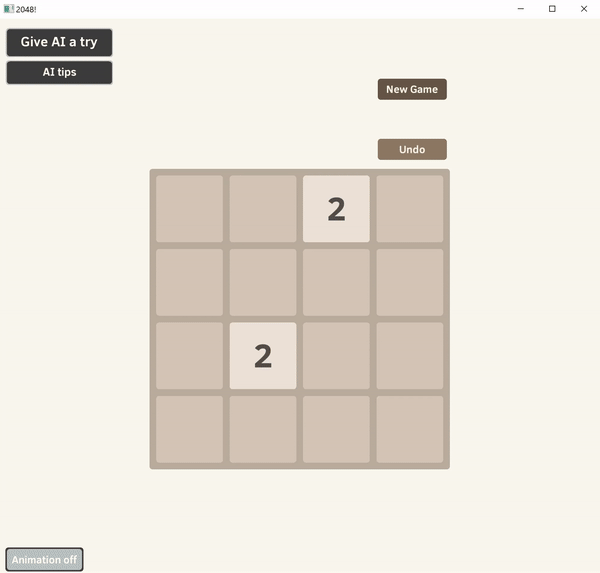

# 2048_App

A 2048 App for Windows. Implements basic logic, visuals and a tree planing solver. Recreates the classic gameplay
where possible.

Controls - keyboard arrows.

### Overview
Basic functionality overview:  

A sped-up glance at the solver's capability (success rate ~90%):  
